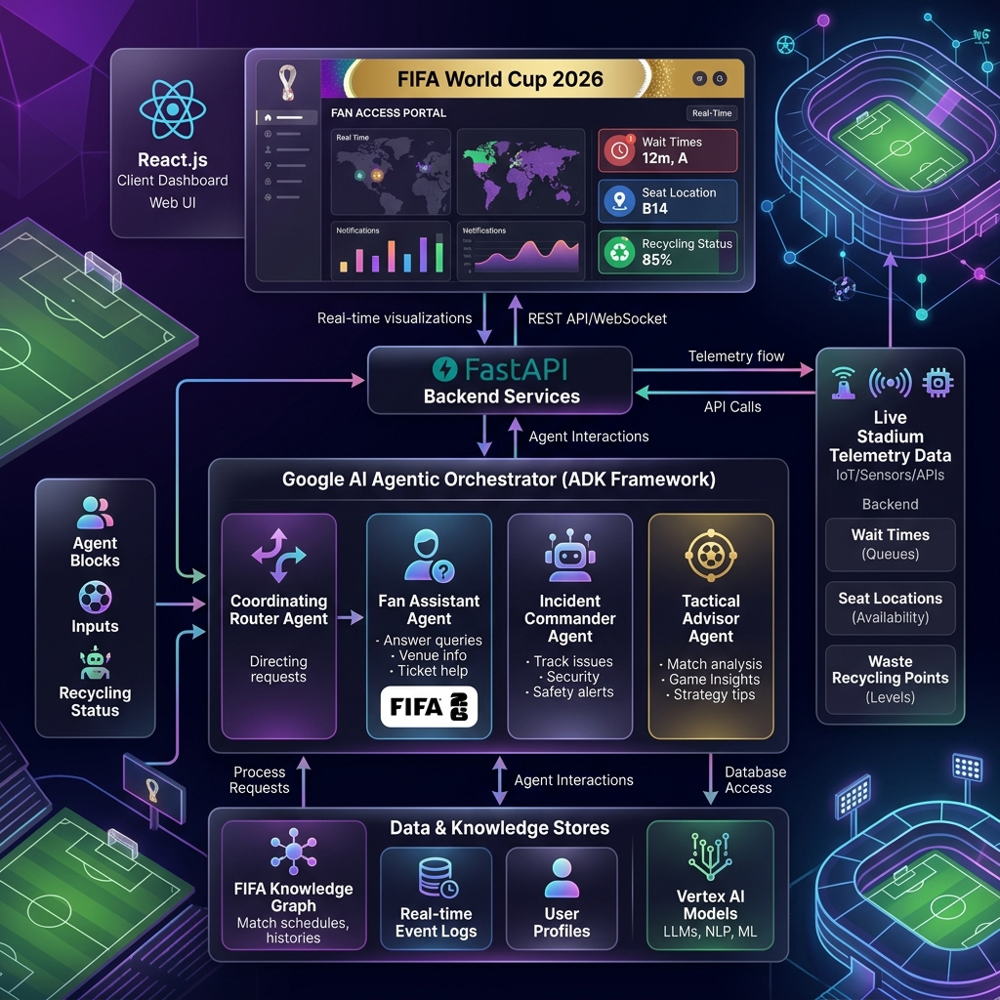

# FIFA 2026 Smart Arena & Operations Command Center (SAOCC)

An enterprise GenAI multi-agent platform designed to enhance stadium operations, safety management, fan navigation, and sustainability at MetLife Stadium during the **FIFA World Cup 2026**. Built on the **Google Agent Development Kit (ADK)** and orchestrated via **React.js**.

---

## 🎨 System Architecture
Below is the system architecture diagram illustrating the real-time client-backend telemetry loop and agent coordination:



*For the complete technical Mermaid diagrams and detailed component code links, please read the [walkthrough.md](./walkthrough.md) guide.*

---

## 📂 Codebase Organization & Map

```
FIFA-PromptWars/
├── app/
│   ├── agents/                   # Modular Google ADK Sub-Agents
│   │   ├── __init__.py           # Exports and bundles agents
│   │   ├── coordinator.py        # Coordinating router agent (evaluates intent)
│   │   ├── fan_assistant.py      # Fan wayfinding, food menu, & recycling agent
│   │   ├── incident_commander.py  # Safety dispatching & volunteer matching agent
│   │   └── tactical_advisor.py   # Incident command advisor agent
│   ├── prompts/                  # Externalized system prompt templates
│   │   ├── coordinator.txt
│   │   ├── fan_assistant.txt
│   │   ├── incident_commander.txt
│   │   └── tactical_advisor.txt
│   ├── tools/                    # Dynamic Python telemetry tools
│   │   ├── __init__.py           # Exports tools
│   │   ├── telemetry_tools.py    # Wayfinding paths, wait times, menus, match scores
│   │   └── volunteer_tools.py    # Roster status and dispatch matching
│   ├── config.py                 # Core app variables (loaded via .env)
│   └── main.py                   # FastAPI server, session syncing & mock fallback
├── frontend/                     # React.js (Vite) Client Dashboard
│   ├── src/
│   │   ├── App.jsx               # Dashboard, maps, voice STT/TTS hooks
│   │   ├── data.js               # Translation registry (EN, ES, FR, AR, PT, HI, TA)
│   │   └── index.css             # Glassmorphism Obsidian CSS styles
│   ├── package.json              # Client packages and Vite configuration
│   └── vite.config.js
├── .env                          # Local credentials container
└── walkthrough.md                # Deliverable walkthrough documentation
```

---

## 🚀 Quick Start Guide

### 1. Configure Credentials (Optional)
The application defaults to **Offline Simulation Mode** and operates completely without any credentials out-of-the-box. 

If you want to demonstrate the **Live GenAI Multi-Agent router**, create a `.env` file in the project root:
```env
GOOGLE_API_KEY=your-copied-api-key
GEMINI_API_KEY=your-copied-api-key
```
(Alternatively, you can paste the API key directly in the dashboard UI using the Settings icon ⚙️).

### 2. Start the FastAPI Backend Server
```bash
# Install backend dependencies
python3 -m pip install -r requirements.txt

# Launch uvicorn service
python3 -m uvicorn app.main:app --port 8000
```
*The API is hosted at http://localhost:8000. Interactive Swagger documentation is available at http://localhost:8000/docs.*

### 3. Start the React Frontend Server
```bash
# Navigate to the client directory
cd frontend

# Install package dependencies
npm install

# Start Vite hot-reload server
npm run dev
```
*Open http://localhost:5173/ in Google Chrome to start testing.*

---

## 🛠️ Key Features to Demonstrate

1. **🎙️ Voice Agent & 🔊 Audio Readout:** 
   Toggle the microphone button next to the chat bar to record speech, and activate the speaker button to hear localized agent responses read aloud. Supports English, Spanish, French, Portuguese, Arabic, Hindi, and Tamil scripts and speech locales.
2. **📍 Seating Wayfinding:**
   Input Gate and Section details (e.g. Gate B, Section 102) to draw glowing blue paths on the stadium SVG and print step-by-step coordinates.
3. **🌱 Eco-Champion Points:**
   Report plastic bottle or aluminum recycling to earn points (+15 points with pop-up animation) and display waste instructions.
4. **🚨 Operations Command Center:**
   Navigate to the Operations Center tab to report safety alerts, run structural AI incident analysis, and dispatch recommended volunteers based on specialty rosters.
5. **⛈️ Contingency Overrides:**
   Simulate weather delays (Severe Storm Event) or transit halts to override announcer command templates.
